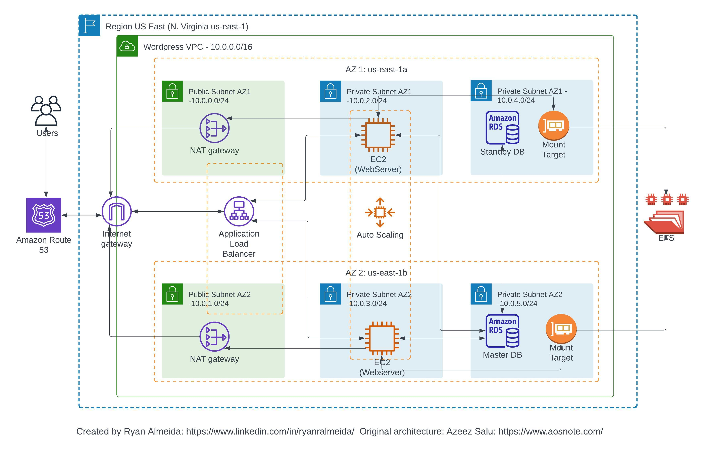

# Deploy a 3-Tier Network VPC Architecture on AWS

## A manually configured and fully functional EXAMPLE 3-Tier cloud project deployed on AWS  implementing VPC networking resources and a Wordpress website

This project is an example that was built along with a tutorial series from AOSNOTE (www.aosnote.com) that teaches you how to build a classic 3-Tier application which includes the Web Tier, Application Tier, and Data Tier. The project also includes deploying these resources in a custom built VPC, from scratch, and deploying a Wordpress website as the final product.

This is a great project to solidify core AWS networking principles and getting some hands on experience with building n-tier applications which are used in the everyday world. In particular, this project shows how to do the following:

- Create a custom VPC from scratch, with public and private subnets in 2 availability zones
- Enchancing the architecture by adding NAT Gateways, Application Load Balances and Auto Scaling Groups
- Creating a MYSQL RDS database for the data tier
- Using Amazon EFS for the webservers to have access to shared files
- Using ECS Instances to host the website
- Using ALBs and ASGs to distribute the traffic as well as making the website highly scalable, fault tolerant and elastic
- Use Route 53 and AWS Certificate Manager to customize DNS route and secure the website

## Architectural Diagram:

## Learning Outcomes:
- This project helps to solidify your grasp on core AWS networking concepts, and also exposing you to a common architectural design pattern in the cloud known as “N-Tier Architecture”, also known as “Layered Architecture”. 
- By deploying this project, especially from scratch, you gain a deeper understanding of networking and infrastructure setup in AWS.
- Creating a custom VPC with public and private subnets in multiple availability zones helps you grasp the concept of high availability, as well as isolating and securing different tiers of an application. 
- Enhancing the architecture with NAT Gateways, Application Load Balancers (ALBs), and Auto Scaling Groups (ASGs) allows you to learn about fault tolerance, and scalability. Deploying a MySQL RDS database for the data tier familiarizes you with managed database services and the considerations for data persistence. 
- Utilizing Amazon EFS for shared file access provides insights into shared storage solutions. Leveraging EC2 Instances for hosting the website as part of the application tier introduces you to the power and agility of on-demand compute services. 
- Utilizing Route 53 and AWS Certificate Manager for DNS customization and website security teaches you about domain management and SSL certificate integration.
- Overall, this project equips you with a comprehensive skill set in networking, infrastructure design, database management, storage solutions, compute services, scalability, and security, equipping you with an order-of-magnitude increase in cloud proficiency, from the previous 2 projects.